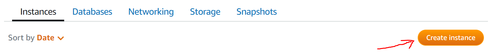
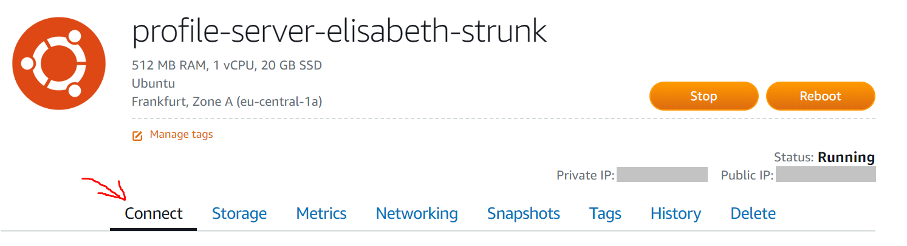
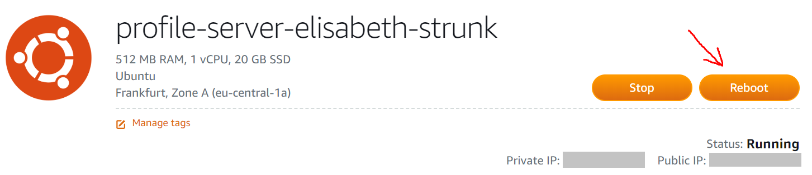

# Udacity_FullStack_LinuxServerConfiguration
Linux server configuration project of the [Udacity Full Stack Web Developer Nanodegree Program](https://www.udacity.com/course/full-stack-web-developer-nanodegree--nd004).<br>
<br>

## Get your server
Go to https://lightsail.aws.amazon.com and log in.<br>
Click on *Create Instance*:<br>
<kbd></kbd>
<br>Choose the following configurations for your instance:

* Select your instance location according to your own location.
* Under *Pick your instance image* -> *Select a platform* choose *Linux/Unix*
* Under *Pick your instance image* -> *Select a blueprint* first click on *OS Only*, then choose *Ubuntu 16.04 LTS*
* Under *Pick your instance image* -> *OPTIONAL* click *Change SSH key pair* and create a new SSH key pair by...
    * clicking on *Create New*
    * choosing your location
    * choosing a name for your key pair (profile-server)
    * click on *Generate Key Pair*
    * download the key by clicking *Download Key*
* Under *Choose your instance plan* choose a suitable payment model ($3.50 USD - First month free)
* Under *Identify your instance* choode a name for your instance (profile-server-elisabeth-strunk)

Click *Create instance*.<br>
You will be redirected to the *Instances* tab.<br>
Your new instance is in the progress of being activated. Wait for the activation process to finish. You can see, if the activation process has already finished by looking at the visualization of your new instance:<br>
**Before:**<br>
<kbd></kbd>
<br>**After:**<br>
<kbd></kbd>
<br>

## Access your server via SSH
Use PuTTY or the tool of your choice to connect to your instance. Instructions on how to do this are provided by Amazon.<br>
To view the instructions:

* Click on your instance to go to the instance's site.
* Make sure you are on the *Connect* tab:<br>
<kbd></kbd>
* Click that little *(?)* next to *Connect using your own SSH client*.
<br>

## Secure your server
Make sure the software packages installed on the server are up to date:

* Update the source list:
    ```bash
    sudo apt-get update
    ```
* Upgrade installed packages:
    ```bash
    sudo apt-get upgrade
    ```

<br>Change the SSH port from 22 to 2200:

* Make sure to configure the Lightsail firewall first:

    * Go to your instance's site on https://lightsail.aws.amazon.com.
    * Go to the *Networking* tab:<br>
    <kbd></kbd>
    * In the *Firewall* section add another rule "Custom TCP 2200"

* Use PuTTY or the tool of your choice to connect to your instance (see *Access your server via SSH* section of this readme)
* Change the port number:

    * Open */etc/ssh/sshd_config* (e.g. with vim):
        ```bash
        sudo vim /etc/ssh/sshd_config
        ```
        The *sudo* is important because you need sudoer rights to change the content of the file.
    * Look for the section titled *# What ports, IPs and protocols we listen for*.
    * Change the number after *Port* from 22 to 2200.
    * Save your changes.

* Reboot your instance by clicking the *Reboot* button on your instance's site:<br>
<kbd></kbd> 

After that, if you try connecting on port 22, you will find that this is no longer possible. Instead you have to connect to port 2200 now.

<br>Configure the Uncomplicated Firewall (UFW):

* Check if UFW is active:
    ```bash
    sudo ufw status
    ```
* It should be inactive. If it is active, disable it using
    ```bash
    sudo ufw disable
    ```
* Change the settings:
    ```bash
    sudo ufw default deny incoming
    sudo ufw default allow outgoing
    sudo ufw allow 2200/tcp
    sudo ufw allow http
    sudo ufw allow ntp
    ```
* Enable UFW:
    ```bash
    sudo ufw enable
    ```
<br>

## Give grader access
In order for your project to be reviewed, the grader needs to be able to log in to your server.<br><br>
SSH into your server and set up a new user with sudo permission:<br>
Example: user with username *grader*
```bash
sudo adduser grader
```
During the creation process, you are asked to provide a password. Type in the password and confirm it by typing it in a second time. (udacity-1)<br>

A list of users with sudo rights can be found in */etc/sudoers*.
In Ubuntu, there also is a file */etc/sudoers.d* that gets included in */etc/sudoers*. System updates can override sudoers, but not sudoers.d. That means added super users will not be lost through a system update, if you set them up in *sudoers.d* instead of *sudoers*.<br>

So, to give the grader user sudo rights:<br>

* Create the sudoers.d file for your new user:
    ```bash
    sudo touch /etc/sudoers.d/grader
    ```
* Open the file you just created (e.g. with vim):
    ```bash
    sudo vim /etc/sudoers.d/grader
    ```
* Add the following line to the grader file:
    ```bash
    grader ALL=(ALL) NOPASSWD:ALL
    ```
<br>

Create an SSH key pair for grader using the ssh-keygen tool:<br>

* On your local machine (**not** on your server!) open a bash session and run:
    ```bash
    ssh-keygen
    ```
* During the keygen process, enter the file (incl. path) in which to save the key (grader_key for example)
* During the keygen process, enter in a password and confirm it by typing it in a second time.
* Two files will be generated in the specified path:

    * the private key (grader_key) and 
    * the public key (grader_key.pub)

* Copy the contents of the file *grader_key.pub* (on your local machine) for later.
* On your server change into grader:
    ```bash
    su grader
    ```
* Change into the home directory:
    ```bash
    cd ~
    ```
* Create a new directory called *.ssh*:
    ```bash
    mkdir .ssh
    ```
* Create a file called authorized_keys:
    ```bash
    sudo touch ~/.ssh/authorized_keys
    ```
* Open the file you just created (e.g. with vim):
    ```bash
    sudo vim ~/.ssh/authorized_keys
    ```
* Paste the content of the file *grader_key.pub* you copied earlier on your local machine into the *authorized_keys* file.
* Save and exit.
* Adjust the permissions on the *.ssh* directory and the *authorized_keys* file:
    ```
    sudo chmod 700 .ssh
    sudo chmod 644 .ssh/authorized_keys
    ```
* Give *grader* ownership over the *authorized_keys* file:
    ```
    sudo chown -R grader.grader /home/grader/.ssh
    ```
* Check the */etc/ssh/sshd_config* file if *PasswordAuthentication* is set to *no*:
    ```bash
    cat /etc/ssh/sshd_config
    ```
* If it is not set to no, set it to no by editing */etc/ssh/sshd_config* (e.g. with vim).
* Restart SSH:
    ```
    sudo service ssh restart
    ```

Now on a remote machine you can use the private key file (grader_key) to connect to the grader user on the server - using the same procedure as you did before with the default user and the Lightsail key pair.
<br>

## Prepare to deploy your Python 3 Flask project
Please note that the following instructions are suitable, if you want to deploy a **Python 3 Flask** application onto your server. Other kinds of applications (including Python 2 applications) need different prerequisites that are not covered here!

Configure the local timezone to UTC:

* Check the timezone:
    ```bash
    date
    ```
* If the timezone is not set to UTC, change the timezone to UTC:
    ```bash
    sudo timedatectl set-timezone UTC
    ```

Install and configure Apache to serve a Python mod_wsgi application:<br>
Connected as the *grader* user, follow the following steps.

* Install the Apache engine:
    ```bash
    sudo apt-get install apache2
    ```
* Check the successful installation of Apache:

    * On your local machine open your browser
    * Enter your instance's public IP address in the address bar
    * If the installation was successful, the browser should show the *Apache2 Ubuntu Default Page*

* Install wsgi library functions for your Apache:
    ```bash
    sudo apt-get install libapache2-mod-wsgi-py3
    ```
* Enable *mod_wsgi*:
    ```bash
    sudo a2enmod wsgi
    ```

Prepare Python 3: 

* Install some general Python libraries:
    ```bash
    sudo apt-get install libpq-dev python-dev
    ```
* Install the needed Python version:<br>
    Ubuntu 16.04 comes with Python 3.5. If your application needs Python 3.6 or higher, you have to manually install the required Python version. (If your application runs fine with Python 3.5, skip the following steps.)<br>
    Example: My [*Item Catalog*](https://github.com/ElisabethStrunk/Udacity_FullStack_ItemCatalog) application was developed and tested on Python 3.7.0.

    * Ubuntu 16.04's *apt-get* does not find the python3.7 package, so you need to install it from its source code. This requires the installation of the following packages first:
        ```bash
        sudo apt install build-essential zlib1g-dev libncurses5-dev libgdbm-dev libnss3-dev libssl-dev libreadline-dev libffi-dev wget
        for pkg in build-essential zlib1g-dev libbz2-dev liblzma-dev libncurses5-dev libreadline6-dev libsqlite3-dev libssl-dev libgdbm-devliblzma-dev tk8.5-dev lzma lzma-dev libgdbm-dev
        do
            sudo apt-get -y install $pkg
        done
        ```
    * Download the source code of the desired Python release from the Python download page:
        ```bash
        cd /tmp
        wget https://www.python.org/ftp/python/3.7.0/Python-3.7.0.tar.xz
        ```
    * Extract the file and install:
        ```bash
        tar -xf Python-3.7.0.tar.xz
        cd Python-3.7.0
        ./configure --enable-optimizations
        ./configure --enable-loadable-sqlite-extensions
        make -j 1
        sudo make altinstall
        ```
    * Check if the desired version of Python was successfully installed:
        ```bash
        python3.7 --version
        ```
<br>

Prepare virtual environment tools:

* Install pip:
    ```bash
    sudo apt-get install python3-pip
    ```
* Use pip with the --user option to do a user installation of Pipenv:
    ```bash
    pip install --user pipenv
    ```
* Make sure that the user base binary directory is added to your PATH to make pipenv available to the shell:

    * Determine the location of your user base binary directory:
        ```bash
        python3 -m site --user-base
        ```
        Usually that will be */home/grader/.local*.
    * Check, if this path is already added to PATH:
        ```bash
        echo $PATH
        ```
        If it is already added, you can skip the following steps.
    * Edit *~/.profile* (e.g. by using *vim*):
        ```bash
        sudo vim ~/.profile
        ```
    * Add the following lines to *~/.profile*:
        ```bash
        # add Python USER_BASE to PATH variable
        export PATH="$PATH:/home/grader/.local/bin"
        ```
    * Put your changes into effect:
        ```bash
        source ~/.profile
        ```

Finally, install git:
```bash
sudo apt-get install git
```
<br>

## Deploy a project onto your server
Example: My [*Item Catalog*](https://github.com/ElisabethStrunk/Udacity_FullStack_ItemCatalog) project.<br>

Clone and setup your Python Flask project from a Github repository you created earlier:<br>

* Create your project folder:
    ```bash
    sudo mkdir /var/www/item_catalog
    ```
* Clone your repository into the folder:<br>
    ```bash
    cd /var/www/item_catalog
    sudo git clone https://github.com/ElisabethStrunk/Udacity_FullStack_ItemCatalog.git
    ```
* Rename the project to the name you want it referred to on your server:
    ```bash
    sudo mv ./Udacity_FullStack_ItemCatalog ./item_catalog
    ```

Set up a virtual environment for your project to run in:

* Since Pipenv manages dependencies on a per-project basis, it is important to install all dependencies from within the Python project folder! To make sure that pipenv has access to the project folder, change the permissions for the corresponding subdirectory of your project's directory:
    ```bash
    sudo chmod 777 /var/www/item_catalog/item_catalog/app
    ```
* Then change into the directory:
    ```bash
    cd /var/www/item_catalog/item_catalog/app
    ```
* Create a Pipfile to manage your project's dependencies (choose the python version your application needs):
    ```bash
    pipenv install --python 3.7
    ```
* Install all packages your project depends upon, using *pipenv*. In case of my *Item Catalog* project:
    ```bash
    pipenv install "httplib2==0.13.1"
    pipenv install "Flask==1.1.1"
    pipenv install "oauth2client==4.1.3"
    pipenv install "requests==2.22.0"
    pipenv install "SQLAlchemy==1.3.6"
    pipenv install "bleach==3.1.0"
    ```
* Set the *--deploy* flag:
    ```bash
    pipenv install --deploy
    ```

Check, if your application is runnable:
```bash
pipenv run python3.7 application.py
```

Add an *\_\_init\_\_.py* to your project:

* Create the file (if it does not already exist):
    ```bash
    touch /var/www/item_catalog/item_catalog/app/__init__.py
    ```
* Edit the file (e.g. with vim):
    ```bash
    sudo vim /var/www/item_catalog/item_catalog/app/__init__.py
    ```
* Add an import of the Flask application object (in my project the object is called *app*):
    ```python
    from application import app
    ```

Create the .wsgi file:

* Determine the path the virtual environment is located in:
    ```bash
    cd /var/www/item_catalog/item_catalog/app
    pipenv --venv
    ```
    Copy the path for later.
* Create a .wsgi file in the outer directory of your project folder:
    ```bash
    sudo touch /var/www/item_catalog/item_catalog.wsgi
    ```
* Edit *item_catalog.wsgi* (e.g. by using *vim*):
    ```bash
    sudo vim /var/www/item_catalog/item_catalog.wsgi
    ```
* Add the following lines, using the path you copied earlier:
    ```bash
    #!PATH_TO_YOUR_VENV_HERE/bin python3.7
    import sys
    import logging
    logging.basicConfig(stream=sys.stderr)
    sys.path.insert(0,"/var/www/item_catalog/item_catalog")
    from app import app as application
    ```

Set up a virtual host for your project:

* Create an Apache site configuration file:
    ```bash
    sudo touch /etc/apache2/sites-available/item_catalog.conf
    ```
* Edit the configuration file (e.g. with vim):
    ```bash
    sudo vim /etc/apache2/sites-available/item_catalog.conf
    ```
* Add the following lines, using your instance's public IP address:
    ```
    <VirtualHost *:80>
        ServerName YOUR_INSTANCES_IP_ADDRESS_HERE
        ServerAlias YOUR_REMOTE_NAME_SERVER_HERE (optional)
        ServerAdmin ubuntu@YOUR_INSTANCES_IP_ADDRESS_HERE
        WSGIDaemonProcess item_catalog python-path=/var/www/item_catalog:/var/www/item_catalog/item_catalog:PATH_TO_YOUR_VENV_HERE/lib/python3.7/site-packages
        WSGIProcessGroup item_catalog
        WSGIScriptAlias / /var/www/item_catalog/item_catalog.wsgi
        <Directory /var/www/item_catalog/item_catalog/app/>
            Order allow,deny
            Allow from all
        </Directory>
        Alias /static /var/www/item_catalog/item_catalog/app/static
        <Directory /var/www/item_catalog/item_catalog/app/static/>
            Order allow,deny
            Allow from all
        </Directory>
        ErrorLog ${APACHE_LOG_DIR}/error.log
        LogLevel warn
        CustomLog ${APACHE_LOG_DIR}/access.log combined
    </VirtualHost>
    ```
* Enable the virtual host:
    ```bash
    cd /etc/apache2/sites-available
    sudo a2ensite item_catalog.conf
    ```
* Activate the new Apache configurations:
    ```bash
    sudo service apache2 reload
    sudo service apache2 restart
    ```
    Or reboot your instance.
* Test your conf files:
    ```bash
    cd /etc/apache2
    apache2ctl configtest
    ```


## Author

**Elisabeth Strunk**<br>
 https://github.com/ElisabethStrunk<br>
 https://www.linkedin.com/in/elisabeth-strunk/

## Acknowledgments

* Huge thanks to [Michael Wales](https://github.com/walesmd) who authored the Udacity course this project is based upon
* Many thanks to [Daniel Abrão](https://github.com/jungleBadger) who provides [instructions](https://gist.github.com/PurpleBooth/109311bb0361f32d87a2) on how to use Apache, Python 3, venv and wsgi together
* Many thanks to Kundan Singh who wrote an [article](https://www.digitalocean.com/community/tutorials/how-to-deploy-a-flask-application-on-an-ubuntu-vps#step-four-%E2%80%93-configure-and-enable-a-new-virtual-host) on "How To Deploy a Flask Application on an Ubuntu VPS"
* Many thanks to [Kenneth Reitz](https://www.kennethreitz.org) who authored an [Ubuntu manpage](http://manpages.ubuntu.com/manpages/eoan/man1/pipenv.1.html) about using [pipenv](https://github.com/pypa/pipenv) to manage Python packages when deploying network services
* Many thanks to [Website for Students](https://websiteforstudents.com) for providing a [tutorial](https://websiteforstudents.com/installing-the-latest-python-3-7-on-ubuntu-16-04-18-04/) on how to upgrade Python on Ubuntu 16.04
