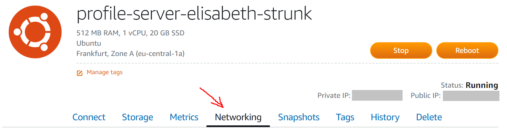

# Udacity_FullStack_LinuxServerConfiguration
Linux server configuration project of the [Udacity Full Stack Web Developer Nanodegree Program](https://www.udacity.com/course/full-stack-web-developer-nanodegree--nd004).<br>

## Get your server
Go to https://lightsail.aws.amazon.com and log in.<br>
Click on *Create Instance*:<br>
<kbd></kbd>
<br>Choose the following configurations for your instance:

* Select your instance location according to your own location.
* Under *Pick your instance image* -> *Select a platform* choose *Linux/Unix*
* Under *Pick your instance image* -> *Select a blueprint* first click on *OS Only*, then choose *Ubuntu 16.04 LTS*
* Under *Pick your instance image* -> *OPTIONAL* click *Change SSH key pair* and create a new SSH key pair by...
    * clicking on *Create New*
    * choosing your location
    * choosing a name for your key pair (profile-server)
    * click on *Generate Key Pair*
    * download the key by clicking *Download Key*
* Under *Choose your instance plan* choose a suitable payment model ($3.50 USD - First month free)
* Under *Identify your instance* choode a name for your instance (profile-server-elisabeth-strunk)

Click *Create instance*.<br>
You will be redirected to the *Instances* tab.<br>
Your new instance is in the progress of being activated. Wait for the activation process to finish. You can see, if the activation process has already finished by looking at the visualization of your new instance:<br>
**Before:**<br>
<kbd></kbd>
<br>**After:**<br>
<kbd></kbd>

## Access your server via SSH
Use PuTTY or the tool of your choice to connect to your instance. Instructions on how to do this are provided by Amazon.<br>
To view the instructions:

* Click on your instance to go to the instance's site.
* Make sure you are on the *Connect* tab:<br>
<kbd></kbd>
* Click that little *(?)* next to *Connect using your own SSH client*.

## Secure your server
Make sure the software packages installed on the server are up to date:

* Update the source list:
    ```bash
    sudo apt-get update
    ```
* Upgrade installed packages:
    ```bash
    sudo apt-get upgrade
    ```

<br>Change the SSH port from 22 to 2200:

* Make sure to configure the Lightsail firewall first:

    * Go to your instance's site on https://lightsail.aws.amazon.com.
    * Go to the *Networking* tab:<br>
    <kbd></kbd>
    * In the *Firewall* section add another rule "Custom TCP 2200"

* Use PuTTY or the tool of your choice to connect to your instance (see *Access your server via SSH* section of this readme)
* Change the port number:

    * Open */etc/ssh/sshd_config* (e.g. with vim):
        ```bash
        sudo vim /etc/ssh/sshd_config
        ```
        The *sudo* is important because you need sudoer rights to change the content of the file.
    * Look for the section titled *# What ports, IPs and protocols we listen for*.
    * Change the number after *Port* from 22 to 2200.
    * Save your changes.

* Reboot your instance by clicking the *Reboot* button on your instance's site:<br>
<kbd></kbd> 

After that, if you try connecting on port 22, you will find that this is no longer possible. Instead you have to connect to port 2200 now.

<br>Configure the Uncomplicated Firewall (UFW):

* Check if UFW is active:
    ```bash
    sudo ufw status
    ```
* It should be inactive. If it is active, disable it using
    ```bash
    sudo ufw disable
    ```
* Change the settings:
    ```bash
    sudo ufw default deny incoming
    sudo ufw default allow outgoing
    sudo ufw allow 2200/tcp
    sudo ufw allow http
    sudo ufw allow ntp
    ```
* Enable UFW:
    ```bash
    sudo ufw enable
    ```
