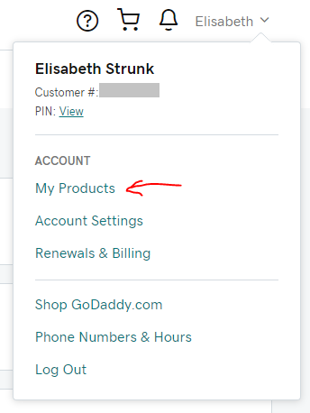
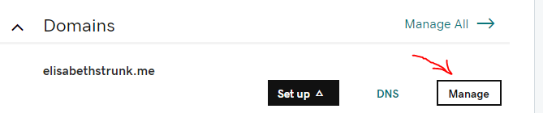

# Connect your domain to your server

When I started this project, I did already own a domain. My domain is registered with [GoDaddy](https://godaddy.com/), so the following steps are using GoDaddy as an example for an internet domain registrar.

## Get your domain
To get a custom domain, go to https://godaddy.com/ and create an account.<br>
Find a domain that is not taken already and buy the registration.<br>
You can find your domain under *My Products*:<br>
<kbd></kbd>
<br>

## Create a static IP for your Lightsail instance:
As a prerequisite for all following steps, you have to create a static IP address for your Lightsail instance:

* Go to https://lightsail.aws.amazon.com/ and log into your account.
* Follow the instructions given by AWS [here](https://lightsail.aws.amazon.com/ls/docs/en_us/articles/lightsail-create-static-ip) to create a static IP address for your server.
<br>

## Update your virtual host configuration
The virtual host you have set up earlier (see [*Deploy your project*](deploy_your_project.md)) is configured with your server's IP address. Since the IP address changed (from your public IP to your static IP) it is neccessary to update the virtual host's configuration file:

* Connect to your server using your new static IP address and your private key.
* Edit the configuration file (e.g. with vim):
    ```bash
    sudo vim /etc/apache2/sites-available/item_catalog.conf
    ```
* Update all lines containing the IP address to the new static IP address, and save your changes.
* Activate the new Apache configurations:
    ```bash
    sudo service apache2 reload
    sudo service apache2 restart
    ```

Your server should now serve your web app at the new IP address.
<br>

## Set up a DNS zone
To set up a DNS zone and link it to your domain, follow the following steps:

* Go to your Amazon Lightsail home site and choose the tab *Networking*.
* Click on the button *Create DNS zone*.
* Enter your registered domain name, such as example.com, into the text box.
* When you scroll down and click *Create DNS zone*, you are redirected to the DNS zone management page.
* Click *Add record* and link your domain to your server instance:

    - Choose *A-record*.
    - In the *Subdomain* form simply type *@* to target the apex of your domain.
    - In the *Resolves to* form choose the static IP you created earlier for your server instance.
    - Save the record by clicking the green checkmark symbol.
* Click *Add record* and map the *www* subdomain to your domain's apex:
 
    - Choose *CNAME record*.
    - In the *Subdomain* form type *www*.
    - In the *Maps to* form type in your domain (e.g. example.com).
    - Save the record by clicking the green checkmark symbol.
* Take note of the 4 nameserver records that were created automatically for your Lightsail DNS zone. You can find them by scrolling down to the section *Name servers*. You will need those nameservers for the next step.
<br>

## Change the nameservers for your domain
You have to change the nameserver records for your domain:

* Go to https://godaddy.com/ and find your domain under *My Products*.
* Click on *Manage*:<br>
    <kbd></kbd>
* Scroll down to the *Additional Settings* and click *Manage DNS*.
* Scroll down to the *Nameservers* section and click *Change*.
* Choose *Custom nameservers*, add the nameservers from your Lightsail DNS zone, and *Save*.

It can take up to **48 hours** for GoDaddy to propagate the nameserver records!<br>
After that, your server can be reached at your domain.