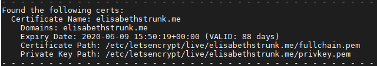
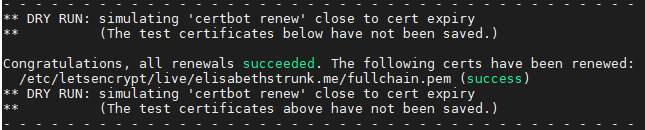

# Set up a TLS/SSL certificate

> This document is part of the [*Linux Server Setup*](README.md) project and is to be viewed within this context.

The web application I deployed onto my server has a user authentication system utilizing Google sign-in as well as Facebook sign-in. Both Google and Facebook allow only secure connections. So, for my app's authentication system to work I had to set up a TLS/SSL certificate for my server.<br>
<br>
The following steps describe how to set up a TLS/SSL certificate for an Apache server running a WSGI app on a Amazon Lightsail Ubuntu 16.4 LTS instance.<br>
<br>

## Configure your firewall
First of all, you need to configure your firewall to allow https (443 TCP) connections. In my case I needed to configure the Lightsail Firewall as well as the Uncomplicated Firewall (UFW) I set up on my server:

Configure the Lightsail instance's firewall:

* Go to https://lightsail.aws.amazon.com/ and log into your account.
* Click on your instance and change into the *Networking* tab.
* Scroll down to the *Firewall* section.
* Click on *Add another* and choose *HTTPS*.<br>
    The entry should now read *HTTPS  TCP  443*.
* Save your changes.
* Reboot your instance by clicking the *Reboot* button on your instance's site:<br>
    <kbd></kbd>

Configure the Uncomplicated Firewall (UFW):

* Connect to your server via SSH.
* Check if UFW is active:
    ```bash
    sudo ufw status
    ```
* It should be active. Disable it using
    ```bash
    sudo ufw disable
    ```
* Change the settings to allow HTTPS (443 TCP) connections:
    ```bash
    sudo ufw allow 443/tcp
    sudo ufw allow https
    ```
* Enable UFW again:
    ```bash
    sudo ufw enable
    ```
<br>

## Set up a TLS/SSL certificate
I used [*Let's Encrypt*](https://letsencrypt.org/) with the recommended [*Certbot*](https://certbot.eff.org/) client to fetch the certificate.<br>
The Let's Encrypt Certbot client has a bug when it comes to WSGI daemon processes. Because of that you need to use a workaround, which is also included in the following steps.

Connect to your server via SSH.
Prepare the configuration file containing the virtual host for your WAGI application:

* Change into the directory containing the configuration files of all enabled Apache sites:
    ```bash
    cd /etc/apache2/sites-enabled
    ```
* Open the configuration file containing the virtual host for your WAGI application (in my case *item_catalog.conf*) with an editor (e.g. vim):
    ```bash
    sudo vim item_catalog.conf
    ```
* Make sure that the *ServerName* is specified with your domain (in my case *elisabethstrunk.me*):
    ```bash
    ServerName elisabethstrunk.me
    ```
* Workaround for the Certbot bug: Comment out the line containing the WSGIDaemonProcess by putting a *#* in front of it.
* Save your changes.

Install the Let's Encrypt Certbot client:

* Add the repository:
    ```bash
    sudo add-apt-repository ppa:certbot/certbot
    ```
* Update the package list to pick up the new repository’s package information:
    ```bash
    sudo apt-get update
    ```
* Install the client:
    ```bash
    sudo apt-get install python-certbot-apache
    ```

Set Up the SSL Certificate:

* Execute the interactive installation to obtain a certificate that covers your domain (in my case *elisabethstrunk.me*):
    ```bash
    sudo certbot --apache -d elisabethstrunk.me
    ```
    Tip: If you have subdomains (e.g. www.elisabethstrunk.me) that are also specified as *ServerAlias* in the configuration file, you can generate one single certificate for your base domain and your subdomain by instead running:
    ```bash
    sudo certbot --apache -d elisabethstrunk.me -d www.elisabethstrunk.me
    ```
* Follow the interactive installation.<br>
    Warning! Choose only the *Redirect* option if you are sure your application works with HTTPS! You can always add the redirect manually later. Since I use a separate static site for my landing page and the route */item_catalog* for my WSGI app, I chose to manually add the redirect later. So, only requests to my WSGI app's route are redirected to the secure connection.<br>
* Certbot will install the certificate, add redirect instructions to the configuration file of your app's virtual host (if you chose the redirect option), and generate a new configuration file with the port 443 virtual host by dublicating the configuration of your app's virtual host. If your app's virtual host configuration file is called e.g. *item_catalog-le-ssl.conf*, you can find this new file at */etc/apache2/sites-enabled/item_catalog-le-ssl.conf*.
* You can print a list of all certificates to the console with:
    ```bash
    sudo certbot certificates
    ```
    Your output at this stage should look something like this:<br>
    <kbd></kbd>

Workaround for the Certbot bug: Reenable the WSGI deamon process that runs your app:

* Open the configuration file (in my case *item_catalog.conf*) with an editor (e.g. vim):
    ```bash
    sudo vim /etc/apache2/sites-enabled/item_catalog.conf
    ```
* Uncomment the line containing the WSGIDaemonProcess by removing the *#* in front of it.
* Save your changes.

OPTIONAL: If you - like me - did not choose the general redirect option during the certificate installation process, but want to redirect requests to your WSGI app's route to the secure connection:

* Open the configuration file (in my case *item_catalog.conf*) with an editor (e.g. vim):
    ```bash
    sudo vim /etc/apache2/sites-enabled/item_catalog.conf
    ```
* Manually add the redirect right before the *WSGIDeamonProcess* line:<br>
    Example: in my case I want to permanently redirect **http**://elisabethstrunk.me/item_catalog to **https**://elisabethstrunk.me/item_catalog
    ```bash
    <VirtualHost *:80>
        ServerName elisabethstrunk.me
        [...]
        Redirect 301 /item_catalog https://elisabethstrunk.me/item_catalog
        WSGIDaemonProcess item_catalog python-home=/var/www/item_catalog/item_catalog/venv
        WSGIScriptAlias /item_catalog /var/www/item_catalog/item_catalog.wsgi
        [...]
    </VirtualHost>
    ```
* Save your changes.

Activate the new Apache configurations:

* Reload and restart the Apache service:
    ```bash
    sudo service apache2 reload
    sudo service apache2 restart
    ```
    Or reboot your instance.
* Test your conf files:
    ```bash
    cd /etc/apache2
    apache2ctl configtest
    ```
* If you get an SSLCertificateFile error (Does not exist or is empty), adjust the permissions on the corresponding *letsencrypt* directories:
    ```bash
    sudo chmod 0755 /etc/letsencrypt/live
    sudo chmod 0755 /etc/letsencrypt/archive
    ```

Go to your browser and test if your site is available at https://[YOUR_DOMAIN_HERE].<br>
<br>

## Test the certificate renewal process
*Let’s Encrypt* certificates only last for 90 days. However, the certbot package runs a renewal task twice daily that renews any certificate that is within 30 days of expiration.<br>
<br>
You can test if this automated renewal process is working on your server, by running:
```bash
sudo certbot renew --dry-run
```
If everything is ok, a success message will be printed to the terminal that looks something like this:<br>
<kbd></kbd><br>
<br>

## Remove certificates
Should you whish to remove a certificate at some point in the future: 

* Run:
    ```bash
    sudo certbot delete
    ```
* Specify which certificate you want to delete.
* Remove the *XX-le-ssl.conf* file from Apache's *sites-enabled* and *sites-available* folders:
    ```bash
    sudo rm /etc/apache2/sites-enabled/XX-le-ssl.conf
    sudo rm /etc/apache2/sites-available/XX-le-ssl.conf
    ```
* Remove the redirect instructions from your XX.conf file.
* Activate the new Apache configuration (steps see above).

<br>

## Author

**Elisabeth Strunk**<br>
 https://github.com/ElisabethStrunk<br>
 https://www.linkedin.com/in/elisabeth-strunk/<br>